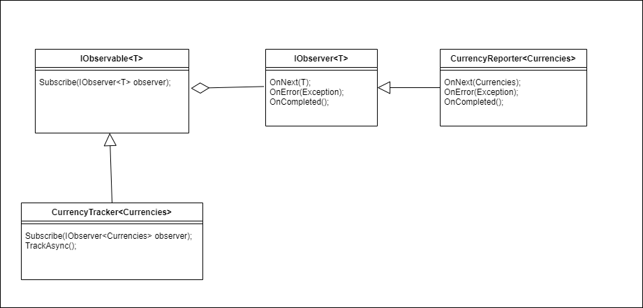

## Observer Pattern
Lets you define a subscription mechanism to notify multiple objects about any events that happen to the object they're observing.

### Clock Example
This example shows us state change of `Clock` which is providing two consumer(`RedClock` and `GreenClock`)
will notify consumers and they get the new state. 
With the console application we get the new state of each and call their `Print` function which give us the current state of time. 

### Ticket Provider
This example illustrate a ticket provider which handle available tickets and with an update to 
a ticket it notify consumers the new state of ticket 
and it can eliminate polling approach which is more efficient way of handling this scenario. 

### Trading Observer
This diagram and example might be familiar to c# developer because instead of making abstract interfaces
we used dotnet approach which is using `IObserver<T>` and `IObservable<T>` interfaces.  
It might be near to real life example which we need to update some consumer components at the same time
with a single fetch of data and consistency is a major issue to us, so we use `Observer` pattern to handle state change and notify consumers.

